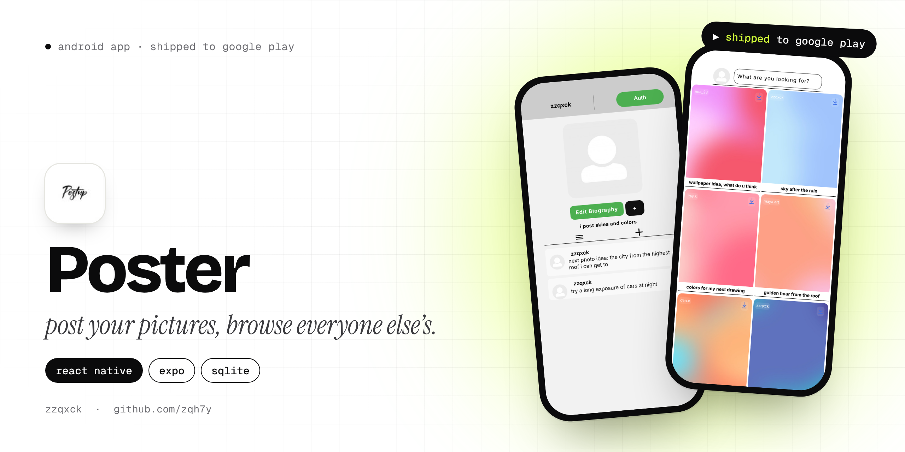
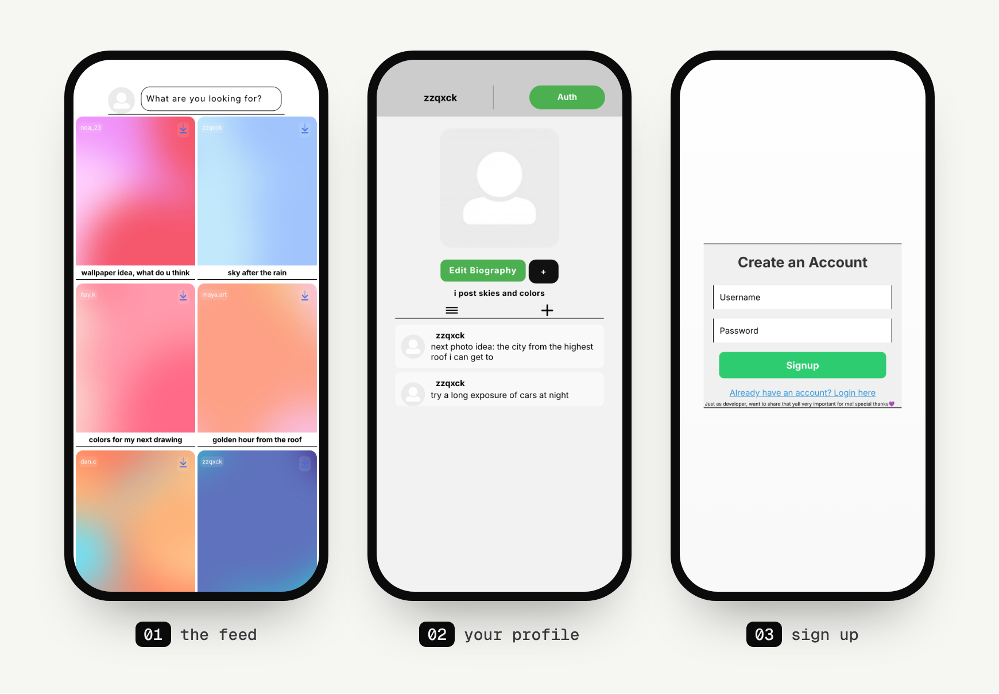

<p align="center">
  
</p>

<p align="center">
  
  
  
  
</p>

# Poster

Poster is a Pinterest-style app for sharing pictures. You post an image with a short caption, scroll a two-column feed of everyone's posts, search it, and save anything you like straight to your gallery. It was published on Google Play as **Poster: Save & Publish Images** (the logo says *Postup*).

It's the most complete of my early apps, with accounts, profiles, a feed, search and moderation, and it taught me a lot, mostly about data. See [the honest part](#the-honest-part) below.

## Screens

<p align="center">
  
</p>

<sub>The feed in these screenshots is filled with sample posts.</sub>

## Features

- **Feed.** A two-column grid that gets shuffled every time it loads, so you see different posts first. Pull down to refresh.
- **Search.** Type in the bar at the top to filter posts by their caption.
- **Save to gallery.** The download button on a post saves the image into a "Poster App" album on your phone.
- **Posting.** Pick an image from your gallery and add a caption (up to 100 characters).
- **Profiles.** A profile picture, a bio, and a list of short text "ideas" (up to 300 characters) under your name. Tap anyone's username in the feed to open their profile.
- **Accounts.** Sign up and log in with a username and password (3 to 20 characters). Taken usernames are rejected.
- **Moderation.** Usernames and profile posts are checked against two word lists (`illegal.js`, `offensive.js`) and blocked if they match. You can long-press your own post to delete it, and a moderator account can delete any post.

## How it's built

| Part | Tech |
|---|---|
| Framework | React Native 0.72, Expo SDK 49 |
| Navigation | React Navigation (stack) |
| Database | `expo-sqlite` (users and posts tables) |
| Files | `expo-file-system`, `expo-media-library`, `expo-image-picker` |
| Session | `@react-native-async-storage/async-storage` |
| Release | EAS Build, published on Google Play |

The screens are in `js/` (`Main`, `Post`, `More`, `Profile`, `Other`, `Writer`, `Login`, `Signup`) and the database code is in `db/`. When you post, the image is moved into the app's own document folder and a row goes into SQLite, so the post keeps working even if you delete the original from your gallery.

## The honest part

All the data lives in **SQLite on the phone**. That means the feed only shows the posts made on that device, and accounts only exist on that device too. A real social app needs a server and a shared database. There's a Firebase config in the repo (`firebase.js`), but the app never actually uses it.

Running into that wall is a big reason my later apps have real backends. [Metz](https://github.com/zqh7y/MetzV2) has its own API and a PostgreSQL database for exactly this.

## Run it yourself

The `master` branch is a flat copy of the source files. The complete Expo project, with the images and the `js/`, `db/` and `words/` folders, is on the **`main`** branch:

```bash
git clone -b main https://github.com/zqh7y/Poster.git
cd Poster
npm install
npx expo start
```

Scan the QR code with Expo Go, or press `a` for an Android emulator.

---

<p align="center">
  Made by <b>zzqxck</b> · <a href="https://zqh7y.github.io/Portfolio/">portfolio</a> · <a href="https://github.com/zqh7y">more projects</a>
</p>
